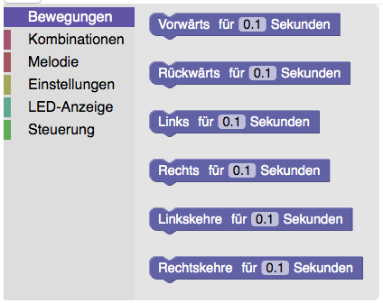

# Robo4girls
Web application and Micro:bit program to wirelessly control a Micro:bit robot platform.

## About the project
Robo4earth builds on the project Robo4girls, a project funded by [netidee](https://www.netidee.at/robo4girls) in 2018.
The [ZIMD](www.zimd.at) (Center for Interaction, Media & Social Diversity) offers a workshop format, where girls build and program robots. The workshops are offered for girls in fifth grade. The aim of the workshops is to inspire the 10- to 11-year old girls in technology and especially robotics.

This repository hosts the R4E web application, which can be reached at [robo4earth.zimd.at](https://robo4earth.zimd.at). The housing and base of the robots are build from wood and are personalized by the kids participating in the workshop.

## Instructions

### Testing the setup 
You can test our R4E App with a computer, a Micro:bit and an USB cable.
#### List of materials
+ a [Micro:bit](https://microbit.org) with usb cable
+ a computer with internet access
+ optionally a [piezo buzzer](https://de.wikipedia.org/wiki/Summer_(Elektronik))
+ optionally 2 croco clamps to connect the buzzer to your Micro:bit. If you do not have croco clamps just use scotch tape and tape the ends of the buzzer cables to the pins of your Micro:bit.

#### Prepare the Micro:bit
Connect your Micro:bit to your computer via USB and load one of the R4E_MICROBIT.hex files on to your Micro:bit. The R4E_MICROBIT.hex files are in the [microbit](microbit) folder of this repository. If you have connected motors via a Micro:bit motor driver board from [Keyestudio](https://wiki.keyestudio.com/Ks0308_keyestudio_Motor_Drive_Breakout_Board_for_micro_bit), from [Elecfreaks](https://www.instructables.com/id/Elecfreaks-Motorbit-User-Guide/) or from [Waveshare](https://www.waveshare.com/wiki/Motor_Driver_for_micro:bit), choose the respective hex file (<i>ks</i>, <i>ef</i> or <i>ws</i>). Otherwise choose either one. If you do not know how to upload a program to your Micro:bit you can look it up [here](https://makecode.microbit.org/device/usb).
<b>If you have a buzzer:</b>
Connect Pin 0 and GND-Pin of your micro:bit to the piezo buzzer like shown in this [fritzing wiring diagram](Bauanleitung/Wiring/buzzer_wiring.png)

#### Connect and program the Micro:bit with the R4E web app
Open the google chrome browser on your mobile device and navigate to the [R4E web application](https://zimdvienna.github.io/Robo4girls/). Don't forget to activate Bluetooth on your device! 
On the R4E website click the <i>Verbinden</i> button, choose your micro:bit from the list and click <i>Koppeln</i>. Wait a few seconds until a confirmation message pops up. If the connection is not established quickly, disconnect the Micro:bit from its power source (computer or battery) and wait for one minute, then try again. If you still cannot establish a connection restart your mobile device. If the Micro:bit is successfully connected, it scrolls a "C" over its LED display.

Now you can program the R4E robot by selecting blocks from the Blockly toolbox and dragging them into the workspace. If you click on one of the 6 sections in the toolbox it will list all blocks available in this section.

You can drag & drop the blocks you want in the workspace. To create a program connect the individual blocks to a chain. To connect the blocks drag a block close to another block until the background between them turns gray and then release it. The blocks snap in place and you should hear a clicking sound when they connect. To start the program click <i>Start</i>. Melodies and Movements will only work if you have a buzzer and motors connected to your Micro:bit.

Have Fun!

